<p align="center">
  
</p>

<p align="center">
  
</p>

---

## 01 // IDENTITY

```
> USER PROFILE LOADED
```

I'm **Namratha**, a B.Tech IT student interested in software engineering, AI/ML and building practical systems for real-world problems.

### Current Interests

```
→ Backend Engineering
→ AI / ML & Generative AI
→ System Design
→ RAG & LLM Applications
```

<p align="center">
  
</p>

---

## 02 // CAPABILITIES

<p align="center">
  
</p>

| Category | Technologies |
|----------|--------------|
| **Languages** | DSA, Java, Python, C, C++, SQL, R |
| **Web** | HTML & CSS, JavaScript |
| **AI / ML** | PyTorch, RAG, Prompt Engineering, Data Analytics (Pandas, NumPy, Matplotlib, Power BI) |
| **Databases** | DBMS, MongoDB, PostgreSQL |
| **Tools** | Git & GitHub |

<p align="center">
  
</p>

---

## 03 // PUZZLE ARCHIVE

```
> PROJECT DATABASE ACCESSED
```

Each project is a puzzle solved through code.

<p align="center">
  
</p>

### PUZZLE_01 — Legacy Code Explorer

| Field | Details |
|-------|---------|
| **Objective** | End-to-end platform for exploring Python GitHub repos with RAG-powered Q&A |
| **Stack** | FastAPI · React · Cohere RAG · Python |
| **Status** | ████████████████████ SOLVED |

---

### PUZZLE_02 — AI Standards Intelligence

| Field | Details |
|-------|---------|
| **Objective** | Tender validation system mapping requirements to verified Indian Standards |
| **Stack** | FastAPI · React · PostgreSQL · Cohere · OCR |
| **Status** | ████████████████████ SOLVED |

---

### PUZZLE_03 — Civic Issue Platform

| Field | Details |
|-------|---------|
| **Objective** | Platform connecting citizens with authorities |
| **Stack** | JavaScript · HTML · Kotlin |
| **Status** | ████████████████████ SOLVED |

---

### PUZZLE_04 — Farmer Assistant AI

| Field | Details |
|-------|---------|
| **Objective** | AI-powered assistant for farmers using RAG and voice interface |
| **Stack** | Python · FAISS · Sentence Transformers · Streamlit |
| **Status** | ████████████████████ SOLVED |

---

### PUZZLE_05 — Kerala Trip Planner

| Field | Details |
|-------|---------|
| **Objective** | Mobile app for trip planning with weather reports and budget calculations |
| **Stack** | JavaScript · React Native |
| **Status** | ████████████████████ SOLVED |

<p align="center">
  
</p>

---

## 04 // EXPERIMENT LAB

```
> RESEARCH DATABASE ACCESSED
```

<p align="center">
  
</p>

| ID | Experiment | Technology | Status |
|----|------------|------------|--------|
| EX-001 | Hand Gesture Recognition | SVM | ✓ |
| EX-002 | Cats vs Dogs Classification | SVM | ✓ |
| EX-003 | House Price Prediction | ML | ✓ |
| EX-004 | K-Means Clustering | ML | ✓ |

<p align="center">
  
</p>

---

## 05 // CURRENT TRIAL

```
> ACTIVE LEARNING SESSION
```

<p align="center">
  
</p>

### TRIAL_007 — Master Spring Boot

| Skill | Progress |
|-------|----------|
| REST APIs | ████████████████████ 100% |
| JPA / Hibernate | ███████████████░░░░░ 75% |
| Security | ████████░░░░░░░░░░░░ 40% |
| System Design | ██████░░░░░░░░░░░░░░ 30% |

```
STATUS: IN_PROGRESS
```

<p align="center">
  
</p>

---

## 06 // SIMULATION RECORD

```
> ACHIEVEMENT DATABASE ACCESSED
```

<p align="center">
  
</p>

```
✓ Member of IEC (Innovation and Entrepreneurship Club)
✓ Member of Hackerabad (Technical Club)
✓ Media and Designing Head — Cisco Club (SNIST)
✓ Organizing Executive — 3Cloud Community Club
✓ Technical Executive — GDC (Game Development Club)
```

<p align="center">
  
</p>

---

## 07 // SYSTEM TELEMETRY

```
> GITHUB ACTIVITY ANALYSIS
```

<p align="center">
  
</p>

<div align="center">


</div>

<p align="center">
  
</p>

---

## 08 // ESTABLISH CONNECTION

```
> CONNECTION CHANNELS AVAILABLE
```

<div align="center">

[](https://www.linkedin.com/in/namratha-gopishetty)
[](mailto:gopishettynamratha0408@gmail.com)
[](https://github.com/NamrathaGopishetty)

</div>

---

<p align="center">

```
SIMULATION STATUS: ACTIVE

Awaiting next challenge...

```

</p>

<p align="center">
  
</p>
