<p align="center">
  
</p>

<p align="center">
  
</p>

---

## 01 // IDENTITY

```
> USER PROFILE LOADED
```

I'm **Namratha**, a B.Tech IT student and aspiring software engineer interested in building practical systems for real-world problems.

### Current Interests

```
→ Backend Engineering
→ AI / ML & Generative AI
→ System Design
→ RAG & LLM Applications
```

<p align="center">
  
</p>

---

## 02 // CAPABILITIES

<p align="center">
  
</p>

| Category | Technologies |
|----------|--------------|
| **Languages** | DSA, Java, Python, C, C++, SQL, R |
| **Web** | HTML & CSS, JavaScript |
| **AI / ML** | PyTorch, RAG, Prompt Engineering, Data Analytics (Pandas, NumPy, Matplotlib, Power BI) |
| **Databases** | DBMS, MongoDB, PostgreSQL |
| **Tools** | Git & GitHub |

<p align="center">
  
</p>

---

## 03 // PUZZLE ARCHIVE

```
> PROJECT DATABASE ACCESSED
```

Each project is a puzzle solved through code.

<p align="center">
  
</p>

<p align="center">
  
</p>

<p align="center">
  
</p>

<p align="center">
  
</p>

<p align="center">
  
</p>

<p align="center">
  
</p>

---

## 04 // SIMULATION RECORD

```
> ACHIEVEMENT DATABASE ACCESSED
```

<p align="center">
  
</p>

```
✓ Member of IEC (Innovation and Entrepreneurship Club)
✓ Member of Hackerabad (Technical Club)
✓ Media and Designing Head — Cisco Club (SNIST)
✓ Organizing Executive — Cloud Community Club
✓ Technical Executive — GDC (Game Development Club)
```

<p align="center">
  
</p>


---

## 05 // ESTABLISH CONNECTION

```
> CONNECTION CHANNELS AVAILABLE
```

<div align="center">

[](YOUR_LINKEDIN_URL)
[](mailto:YOUR_EMAIL)
[](https://github.com/NamrathaGopishetty)

</div>

---

<p align="center">

```
SIMULATION STATUS: ACTIVE

Awaiting next challenge...

```

</p>

<p align="center">
  
</p>
